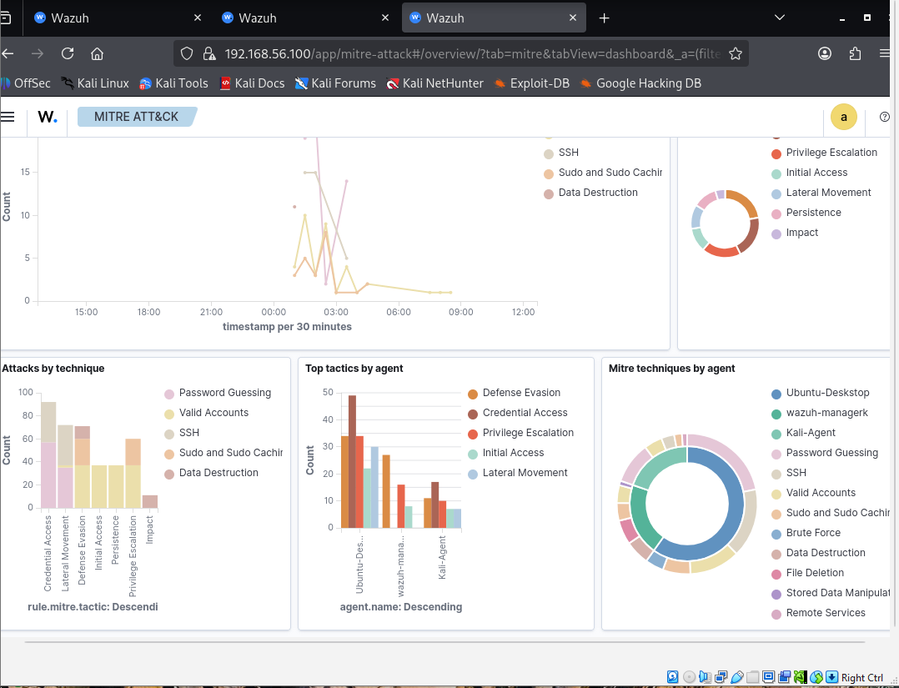

# 🏛️ ArchSentinelFlow: Secure-by-Design Architectural Framework
**Engineering the Trust Layer for Resilient Distributed Systems**

## 🚀 Overview
ArchSentinelFlow is a proactive security framework designed to bridge the "Governance Gap" in distributed cloud environments. Moving beyond reactive patching, this framework implements kernel-level policy enforcement and real-time telemetry validation.

### 📊 Key Performance Metrics
*   **Mean Time to Detect (MTTD)**: 28.5 Seconds
*   **Alert Fidelity**: 100% Correlation to MITRE ATT&CK (T1110)
*   **Infrastructure**: Distributed Ubuntu/Kali/Wazuh Research Node

## 🏗️ Core Architecture
The framework utilizes a **Zonal Integrity Guard (ZIG)** to isolate untrusted traffic and ensure non-repudiation across the ingestion pipeline. 

1.  **Logical Integrity**: Kernel-level enforcement.
2.  **Architectural Neutrality**: Vendor-agnostic security logic.
3.  **Automated Governance**: GitHub Actions CI/CD integration.

## 🧪 Laboratory Environment
This repository contains the technical preprint and supporting assets for the ArchSentinelFlow validation experiment.
*   **Hypervisor**: VirtualBox 7.0
*   **SIEM/XDR**: Wazuh Manager
*   **Automation**: GitHub Self-Hosted Runners

## 🇦🇺 Global Talent & Research Vision
This project serves as foundational evidence for my mission to bridge African innovation with Australian research excellence (UNSW/Monash 2027).

---
© 2026 Charles Owajoba. All Rights Reserved.
