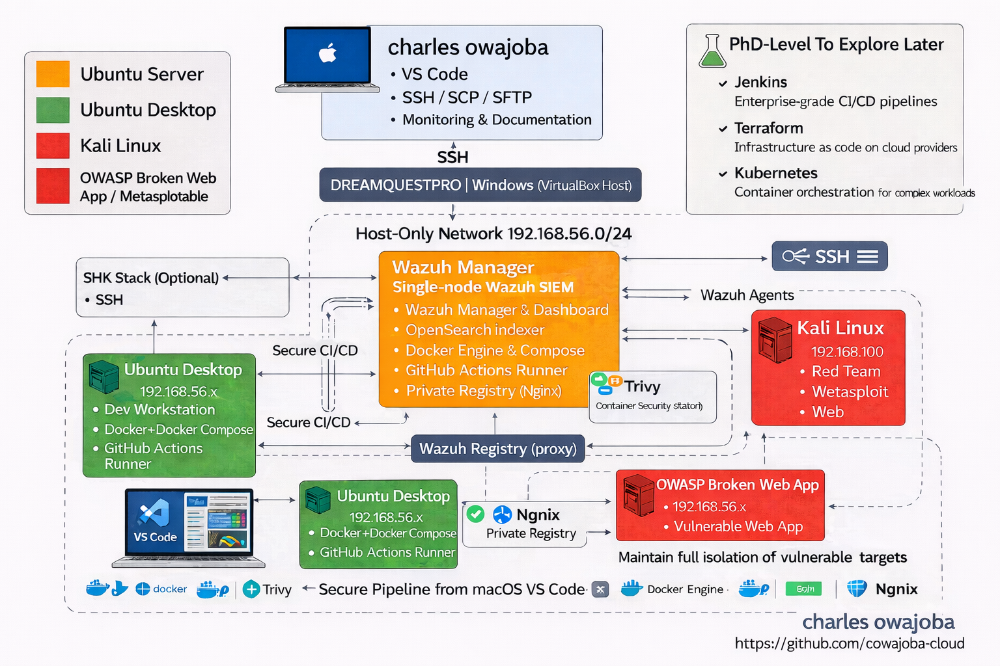

# 🏛️ 2. Introduction: The Resilience Crisis

The global digital economy is facing an unprecedented "Resilience Crisis," with cybercrime costs projected to reach **$10.5 trillion annually by 2025**. While the industry has prioritized rapid cloud adoption and AI scaling, the fundamental architecture of these systems remains reactive. **ArchSentinelFlow** is introduced as a "Secure-by-Design" intervention to move beyond perimeter defense toward **Architectural Integrity**.

### 2.1 The Governance Gap
The primary vulnerability in modern distributed systems is the "Governance Gap"—the space between high-level security policy and the actual kernel-level execution of trust. Traditional models rely on "Post-Processing" filters that are often bypassed by high-velocity adversarial ingestion.

### 2.2 Research Objectives
The objective of the ArchSentinelFlow framework is to provide a reproducible methodology for:
*   **Logical Resilience**: Ensuring system integrity under distributed pressure.
*   **Empirical Validation**: Moving from "claims" to measurable "Mean Time to Detect" (MTTD) baselines.
*   **Standard Alignment**: Mapping distributed telemetry to **MITRE ATT&CK (T1110)**.

*Figure 1: High-level Conceptual Model of Architectural Resilience (The Fortress Strategy).*
