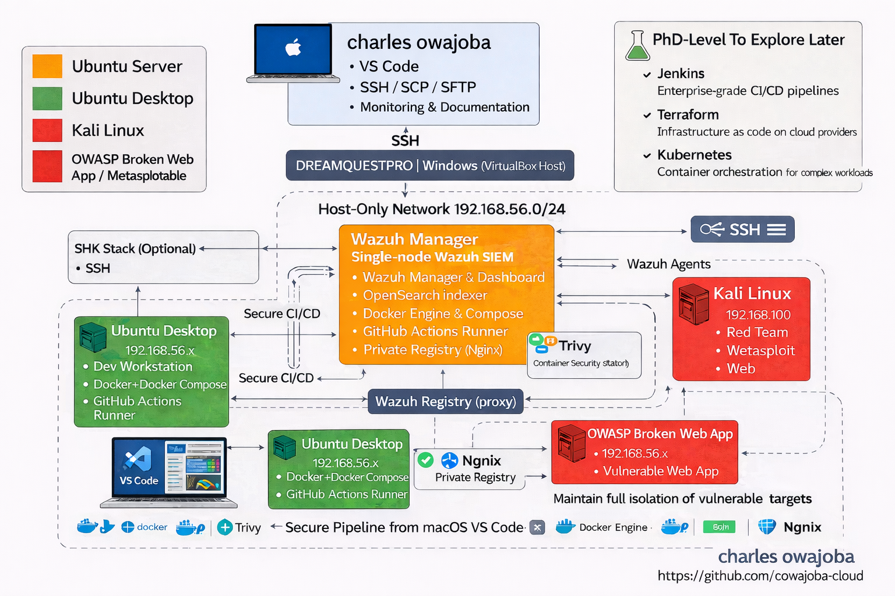

# 🏗️ 4. Proposed Framework: The ArchSentinelFlow Logic

ArchSentinelFlow is a **Secure-by-Design** architectural framework that prioritizes "Logical Resilience" over reactive patching. By implementing a multi-zonal defense strategy, the framework ensures that ingestion integrity is maintained across distributed trust boundaries.

### 4.1 The Zonal Integrity Guard (ZIG)
The framework is divided into three distinct logical zones to prevent unauthorized lateral movement and ensure non-repudiation:

1.  **Zone 1: Ingestion & Orchestration (Untrusted)**  
    Handles raw telemetry, API calls, and developer traffic. This is the "Front Gate" where initial policy checks are applied.
2.  **Zone 2: Sentinel Core (The Logic Center)**  
    The primary validation layer where ingestion is mapped against **ISO/IEC 42001** and **MITRE ATT&CK** heuristics. This zone houses the **Integrity Validator**.
3.  **Zone 3: Trusted Execution & Audit (The Vault)**  
    The final compute layer where validated data is processed and logged into an immutable audit ledger.

*Figure 2: The Technical Implementation Blueprint of the ArchSentinelFlow Research Node (DreamQuestPro Platform).*

### 4.2 Architectural Neutrality
A key innovation of ArchSentinelFlow is its **Architectural Neutrality**. By decoupling the security logic from specific vendor implementations, the framework can be deployed across heterogeneous cloud environments (AWS, Azure, Private Nodes) while maintaining a consistent "Trust Baseline." This is critical for scaling AI research where model integrity is paramount.
yt