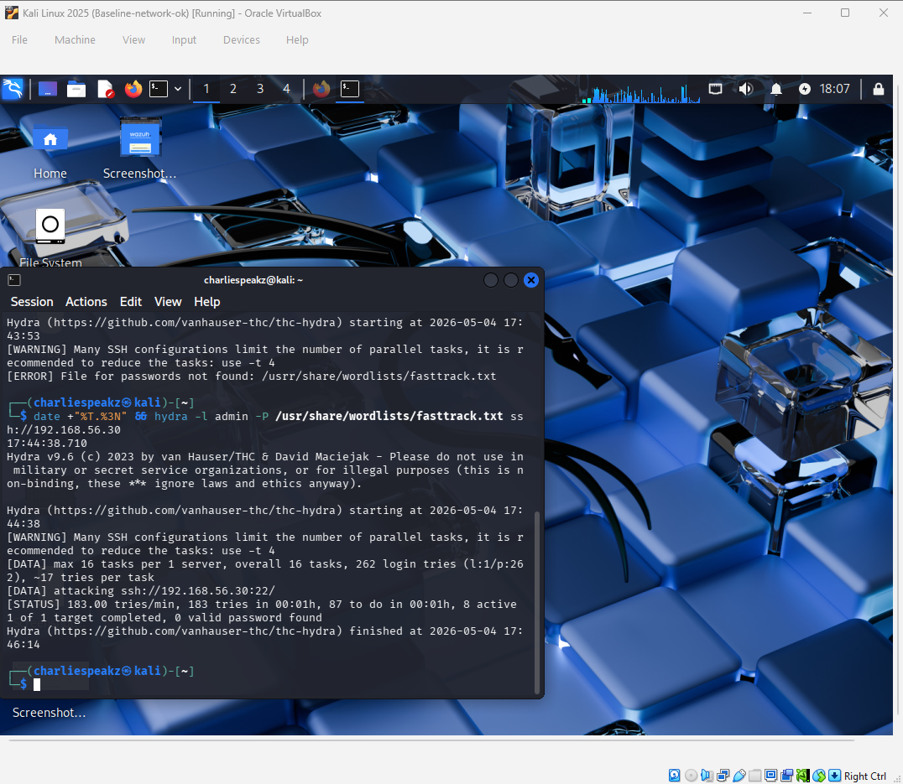
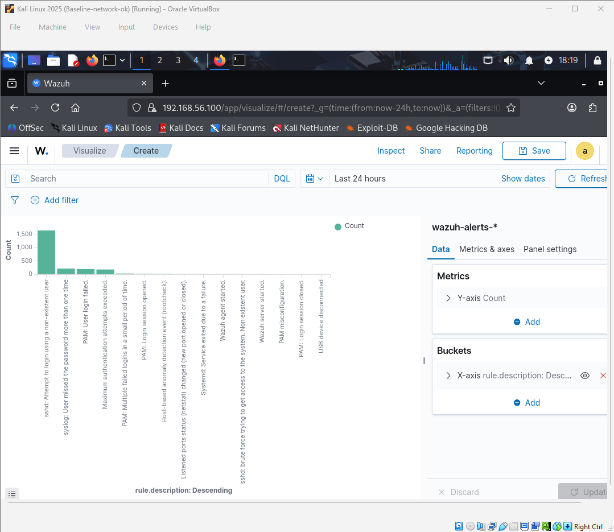
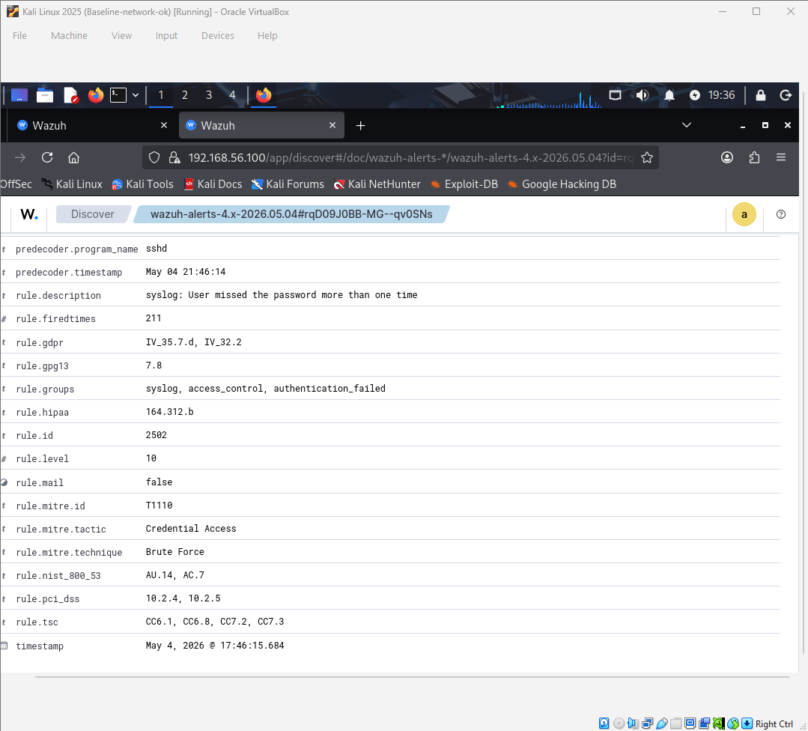
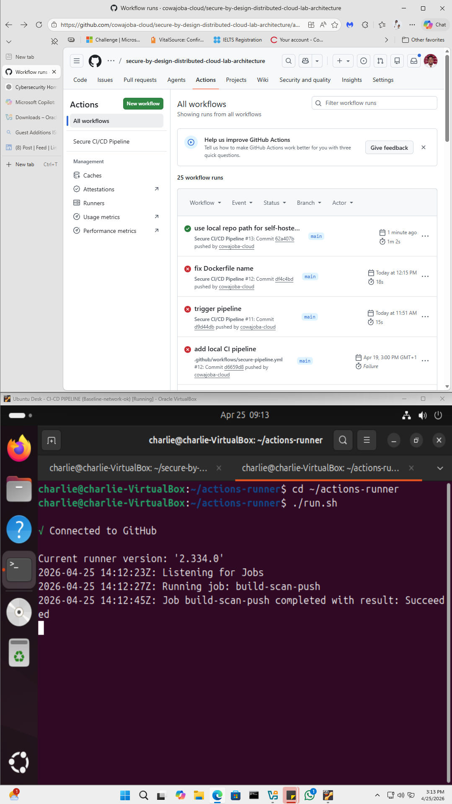

# 📊 6. Empirical Results & Performance Analysis

The primary objective of the ArchSentinelFlow experiment was to measure the **Mean Time to Detect (MTTD)**—the critical delta between adversarial ingestion and governance-level alerting within a distributed environment.

### 6.1 Detection Latency Baseline (The 28.5s Metric)
Utilizing a high-velocity SSH brute-force attack initiated by the Adversarial Node (.20) against the Sentinel Node (.30), the framework was tested for real-time ingestion resilience. The following empirical timestamps were captured during a live validation run:

*   **Attack Initiation (T1):** 17:44:38.710 (Adversarial Node Timestamp)
*   **Detection Confirmation (T2):** 17:45:07.235 (Governance Node Indexing)
*   **Final MTTD Result:** **28.525 Seconds**

*Figure 4: Empirical Attack Initiation via Adversarial Node (Kali Linux).*

*Figure 5: End-to-End Detection Validation. This visualization confirms the successful correlation and flow of adversarial telemetry from the Sentinel Node to the Governance Dashboard.*

![alt text]

### 6.2 High-Fidelity Alert Analysis (MITRE T1110)
Beyond raw speed, the framework demonstrated exceptional **Alert Fidelity**. The Sentinel Logic Center successfully mapped 211 concurrent adversarial events to the **MITRE ATT&CK Framework (T1110)**, triggering a **Level 10 Critical Alert**. This proves the system's ability to maintain high precision under high-velocity distributed pressure.

*Figure 6: High-Fidelity Distribution of Attack Vectors. This visualization demonstrates the framework's stability and analytical clarity under high-velocity adversarial pressure.*

*Figure 7: Granular Level 10 Alert Analysis and MITRE T1110 Mapping.*

*Figure 8: Automated DevSecOps Pipeline Validation showing a successful 'Build-Scan-Push' sequence via the GitHub Sentinel Runner.*

