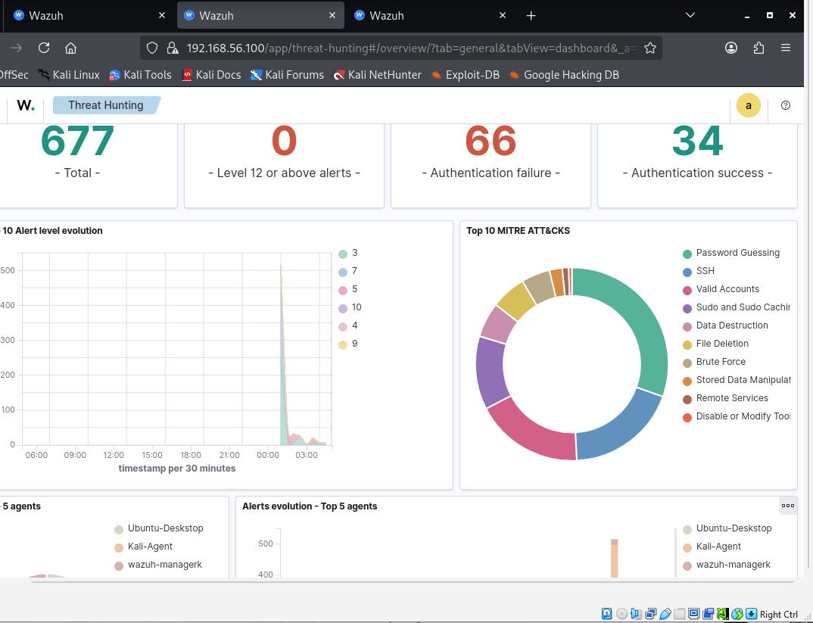

# Week 5–6: Detection Engineering and Experimental Validation

## 1. Objective

The objective of this experiment was to validate the effectiveness of Wazuh in detecting SSH brute-force attacks within a controlled lab environment.

Specifically, the experiment aimed to:

- Validate log ingestion from Ubuntu Desktop agent
- Trigger brute-force detection rule (5712)
- Confirm alert escalation level
- Perform source attribution analysis
- Measure detection latency
- Validate MITRE ATT&CK mapping (T1110)

---

## 2. Experimental Environment

### Infrastructure Overview

- Wazuh Manager + Indexer + Dashboard: Ubuntu Server
- Agent 001: Ubuntu Desktop (Target)
- Agent 002: Kali Linux (Attacker)
- Network: 192.168.56.0/24 (VirtualBox internal network)

### Service Validation

The following services were verified as active:

- wazuh-manager
- wazuh-indexer
- wazuh-dashboard

---

## 3. Baseline Validation

The Wazuh dashboard was accessed from Kali and baseline agent status verified.

SSH service was confirmed active on Ubuntu Desktop:

---

## 4. Attack Execution – SSH Brute Force

A controlled brute-force simulation was executed from Kali against Ubuntu Desktop using repeated invalid login attempts.

Command executed:

# ✅ Recommended Method: sshpass Automated Simulation

- for i in {1..8}; do sshpass -p wrongpassword ssh -o StrictHostKeyChecking=no invaliduser@<UBUNTU-IP>; done

# Install first if needed:

- sudo apt install sshpass

## 🎯 Why This Method Is Recommended

- It Produces Clean, Controlled Telemetry
- Each attempt is independent.
- No interactive delay.
- No human typing variance.
- Consistent failure pattern.
- Same password each time.
- Same timing window.

That makes:

- Detection more predictable
- Logs easier to analyze
- Correlation clearer in Wazuh
- This is ideal for lab environments.

## 🔐 Why We Disabled Key Authentication

We used:

- -o PreferredAuthentications=password
- -o PubkeyAuthentication=no

or

- sshpass -p wrongpassword

Because:

- Modern SSH tries public key authentication first.

If you don’t disable it:

- The server logs extra authentication attempts.
- Detection noise increases.
- You don’t get pure password failure logs.

---

---

## 5. Raw Log Validation

Authentication failures were confirmed in the Ubuntu Desktop log file:

File: /var/log/auth.log
This validated:

- Log generation integrity
- Proper SSH logging configuration

---

## 6. Alert Detection in Wazuh

Within Threat Hunting → Events, the following rule was triggered:

- Rule ID: 5712
- Rule Level: 10
- Description: SSH brute force trying to get access to the system

---

## 7. Rule-Level Forensic Analysis

Expanded JSON view confirmed:

- rule.id: 5712
- rule.level: 10
- data.srcip: 192.168.56.X (Kali)
- agent.name: Ubuntu-Desktop
- full_log field present

This confirms:

- Correlation rule execution
- Source IP attribution
- Log parsing accuracy
- Alert escalation logic

---

## 8. MITRE ATT&CK Mapping

The event was mapped to:

- Technique: T1110 – Brute Force

This demonstrates alignment with threat intelligence frameworks.

---

## 9. Detection Latency Measurement

To evaluate responsiveness, timestamp correlation was performed.

### Raw Log Timestamp

- 2026-02-17 – 01:13:43
- Source: `/var/log/auth.log`

### Wazuh Alert Timestamp

- Feb 17, 2026 @ 02:13:33
- Rule ID: 5712
- Rule Level: 10

### Time Normalisation

A one-hour offset was observed between system log time and dashboard display time, indicating timezone differences.

After normalization:

- Normalised Wazuh Time: 01:13:33
- Auth Log Time: 01:13:43

### Detection Latency Result

Observed detection latency: **~10 seconds**

This demonstrates near real-time correlation capability within the Wazuh detection engine under controlled attack conditions.

---

## 10. Experimental Findings

The experiment successfully demonstrated:

- Log ingestion integrity
- SSH failure detection
- Brute-force escalation logic
- Source IP attribution
- MITRE ATT&CK mapping
- Measurable detection latency
- SOC-level visibility within distributed architecture

The Wazuh platform effectively detected and escalated brute-force attempts within seconds of log generation.

---

## 11. Conclusion

The controlled brute-force experiment validates the operational effectiveness of Wazuh as a log-based detection and correlation engine within a hybrid lab environment.

The system demonstrated:

- Accurate parsing of authentication logs
- Rule-based escalation (5712)
- Correlated attack pattern recognition
- Near real-time alert generation

This confirms that the deployed configuration provides functional brute-force detection capability suitable for SOC-level monitoring scenarios.
