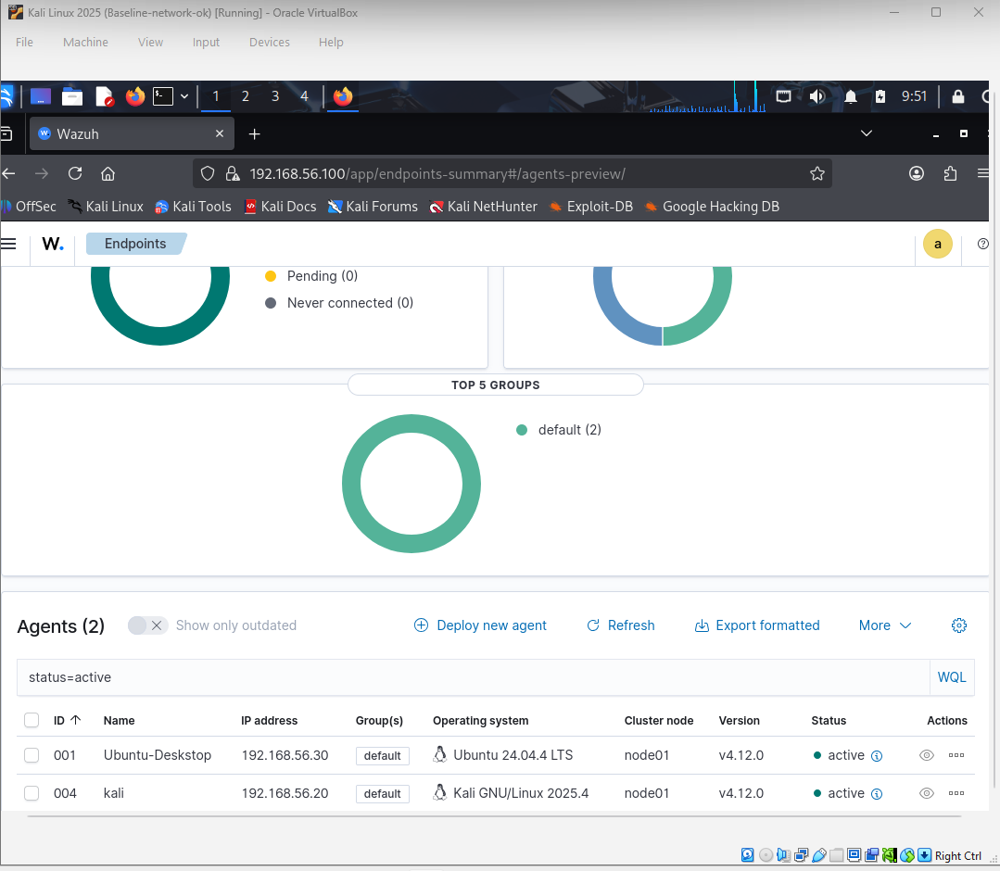
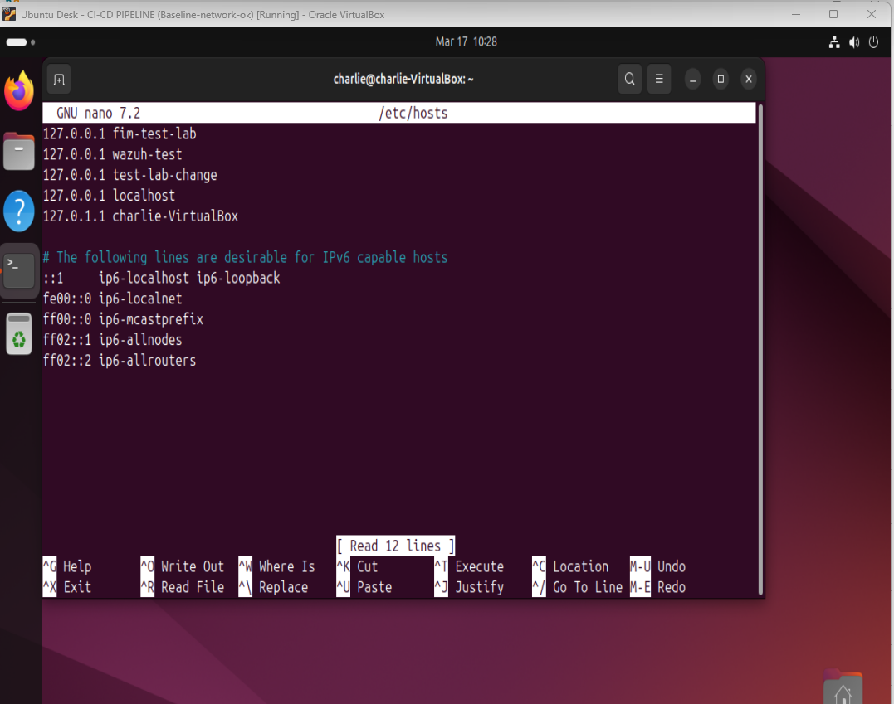
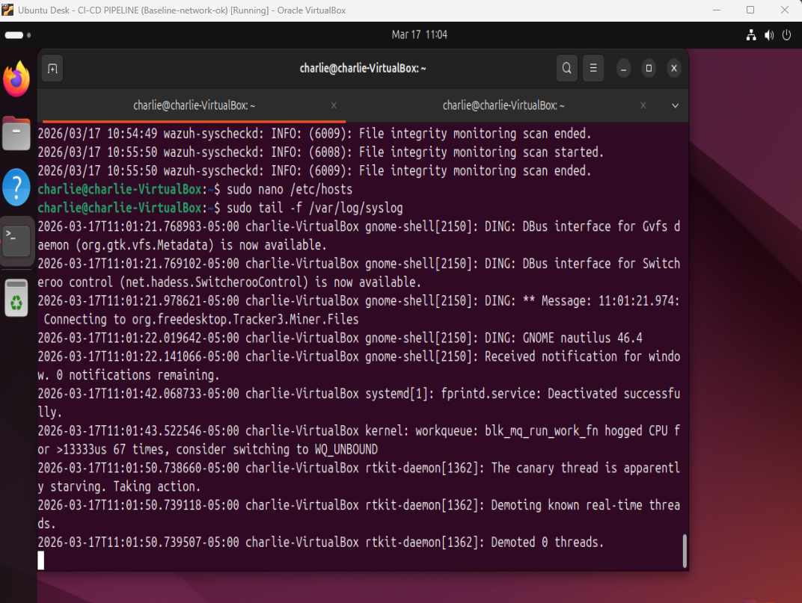
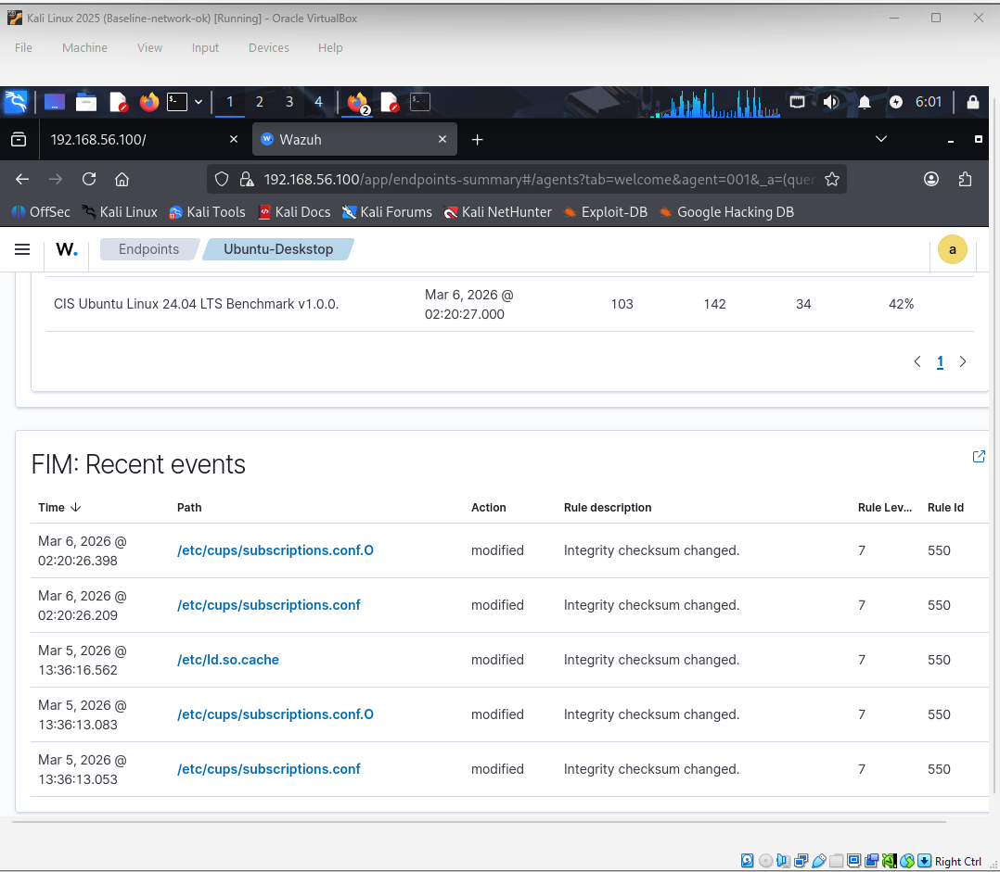
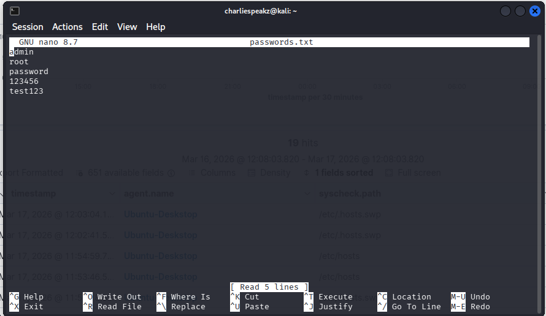
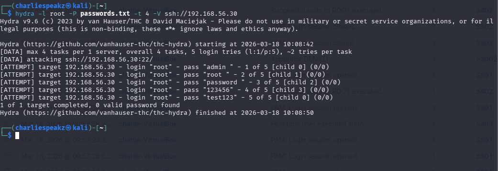
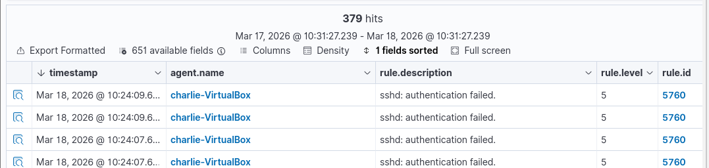
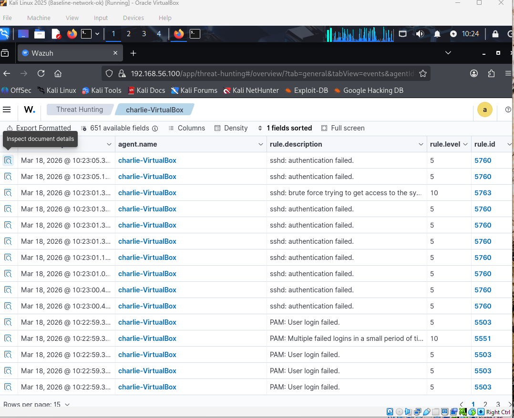
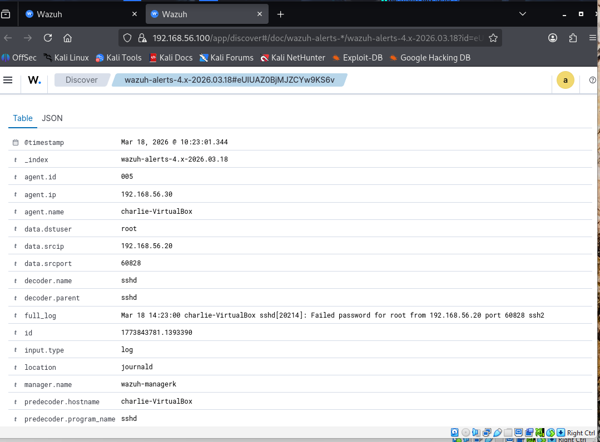
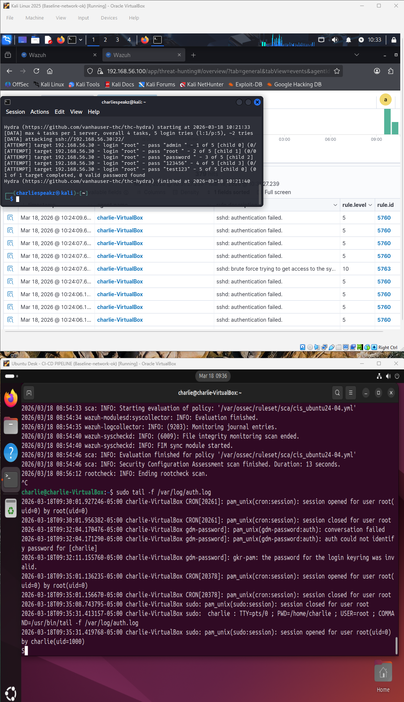

# Week 7–8: Detection Validation & Empirical Benchmarking  
## Focus Area: Detection Performance in Distributed Cloud Architectures

---

# 🔁 Research Continuity (Weeks 1–6 → Week 7–8)

Weeks 1–4:
- Designed secure-by-design distributed cloud architecture.
- Implemented segmentation and hardened configurations.

Weeks 5–6:
- Performed control validation.
- Simulated SSH brute-force attacks.
- Validated Wazuh alert generation.
- Confirmed log ingestion and correlation pipeline.

📌 Week 7–8 Focus:

Shift from:
> “Does detection work?”

To:
> “How well does detection perform under real conditions?”

---

# 🧪 1. Experimental Environment Validation

### Wazuh Dashboard Overview

### Agent Connectivity Status

### Baseline Security Events

📌 Observation:
- Agent successfully connected.
- Events flowing into SIEM.
- System ready for controlled experimentation.

---

# 🧪 2. File Integrity Monitoring (FIM) Validation

### File Modification Command Execution

### Local System Log Confirmation

### Wazuh FIM Detection Alert

📌 Key Insight:
- File change successfully detected.
- Confirms:
  - Log collection ✅
  - FIM engine ✅
  - Alert generation ✅

---

# 🧪 3. SSH Service & Network Validation

### SSH Service Status

### Network Connectivity Test

📌 Observation:
- SSH service active.
- Network communication between nodes confirmed.

---

# 🧪 4. Attack Preparation

### Password List Preparation

📌 Purpose:
- Enable controlled brute-force simulation.

---

# 🧪 5. Brute Force Attack Execution

### Hydra Attack Launch

### SSH Authentication Failures (Target Logs)

📌 Key Validation:
- Attack successfully generated.
- Failed login attempts recorded in system logs.

---

# 🧪 6. Detection & Correlation Validation

### Wazuh SSH Event Ingestion

### Brute Force Detection Alert

📌 Insight:
- Logs ingested into Wazuh.
- Detection rules triggered.
- Correlation engine functioning correctly.

---

# 🧪 7. Alert Investigation

### Alert Detail Analysis

📌 Observation:
- Alert includes:
  - Source IP
  - Attack pattern
  - Rule classification

---

# 🧪 8. End-to-End Detection Validation

### Full Detection Pipeline Confirmation

📌 Validated Pipeline:

Attack → System Logs → Wazuh Agent → SIEM → Alert

---

# 📊 9. Key Experimental Findings

- Detection pipeline successfully validated end-to-end.
- File Integrity Monitoring operates in real-time.
- SSH brute-force activity generates observable logs.
- Wazuh effectively ingests and correlates events.
- Alerts provide actionable security intelligence.

---

# ⚠️ 10. Observed Limitations

- Detection latency not yet quantitatively measured.
- No stress testing under high-volume attack conditions.
- Limited benchmarking across distributed nodes.
- No formal comparison of detection performance metrics.

---

# 🔍 11. Research Gaps Identified

- Lack of empirical detection latency benchmarking frameworks.
- Limited evaluation of SIEM performance under adversarial load.
- Absence of reproducible small-scale distributed testing models.
- Minimal real-world validation of detection pipelines.

---

# ❓ 12. Refined Research Questions

1. How does architecture segmentation affect detection latency?
2. What is the impact of log volume on detection accuracy?
3. How resilient is detection under node isolation?
4. Can detection benchmarking improve secure architecture design?

---

# 🚀 13. Next Phase (Beyond Week 8)

- Introduce detection latency measurement.
- Simulate high-volume attack scenarios.
- Perform distributed node benchmarking.
- Quantify SIEM performance metrics.

---

# 🎯 Long-Term Direction

Transition from:

> Functional validation

To:

> Measurable, reproducible detection benchmarking framework  
for distributed cloud-native architectures.