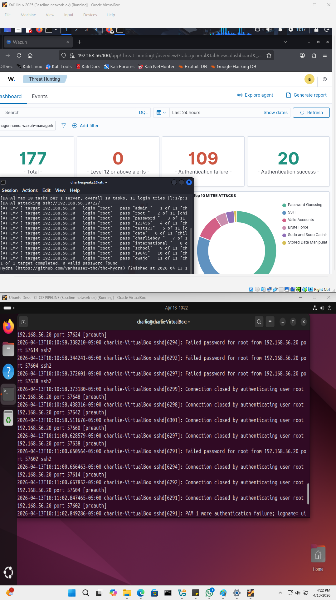

# Week 9–10: Targeted Literature Review & Research Gap Identification  
## Focus: Empirical Detection Validation in Distributed Cloud Architectures

---

# 🔁 Research Continuity (Weeks 1–8 → Week 9–10)

Weeks 1–4:
- Designed secure-by-design distributed cloud architecture  
- Defined trust boundaries and system components  

Weeks 5–6:
- Performed control validation  
- Simulated SSH brute-force attacks  
- Validated Wazuh alert generation  

Weeks 7–8:
- Verified end-to-end detection pipeline  
- Confirmed log ingestion, correlation, and alerting  

📌 Week 9–10 Focus:

Shift from:
**“Detection works”**

To:
**“Detection performance is not empirically measured”**

---

# 🎯 1. Review Approach

This literature review is **targeted and professor-aligned**, focusing on research in:

- Distributed systems security  
- Intrusion detection systems  
- Cloud-native security architectures  
- Detection engineering  

The goal is to identify gaps in:

> Empirical detection validation and performance benchmarking

---

# 📚 2. Reviewed Papers (Professor-Aligned)

## Sharif Abuadbba (UNSW)

Focus:
- Cloud security  
- Insider threat detection  

Observation:
- Strong emphasis on data protection and threat modeling  

Limitation:
- No empirical validation of detection performance  
- No SIEM-based benchmarking  

---

## Zahir Tari (RMIT)

Focus:
- Distributed systems and cloud architectures  

Observation:
- Strong emphasis on scalability and system design  

Limitation:
- No security detection benchmarking  
- No integration with detection pipelines  

---

## Robin Doss (Deakin)

Focus:
- Intrusion detection systems  

Observation:
- Uses simulation-based evaluation  

Limitation:
- No real-world distributed lab validation  
- No latency or performance measurement  

---

## Joseph Liu (Monash)

Focus:
- Cryptographic systems and access control  

Observation:
- Strong theoretical security guarantees  

Limitation:
- No runtime detection validation  
- No operational SIEM analysis  

---

## Ernest Foo (QUT)

Focus:
- Applied cybersecurity and authentication  

Observation:
- Case-based evaluation approaches  

Limitation:
- No detection pipeline evaluation  
- No performance benchmarking  

---

## Ali Shahrestani (University of Newcastle)

Focus:
- Network and IoT security  

Observation:
- Experimental security models  

Limitation:
- Limited SIEM validation  
- No distributed detection benchmarking  

---

# 🔍 3. Cross-Paper Analysis

Across all reviewed works:

- Strong focus on system design and security mechanisms  
- Heavy reliance on simulation or static datasets  
- Minimal real-world detection validation  

❗ Missing consistently:

- Detection latency measurement  
- Log ingestion delay analysis  
- Correlation performance evaluation  
- Distributed SIEM benchmarking  

---

# 🧠 4. Critical Insight

There is a consistent assumption that:

> Detection systems function effectively once deployed  

However, there is little empirical evidence measuring:

- How fast detection occurs  
- How reliable alerts are under distributed conditions  

---

# 🔥 5. Critical Discussion

While existing research provides strong foundations in system design and security mechanisms, there is a consistent lack of empirical validation in operational environments.

Most studies assume detection effectiveness without measuring:

- Detection latency across distributed nodes  
- SIEM ingestion and processing delays  
- Correlation accuracy under real attack conditions  

This highlights a disconnect between theoretical security design and practical detection performance.

---

# 🚨 6. Research Gap Identified

The literature lacks:

- Empirical detection latency benchmarking  
- Real-world distributed validation environments  
- SIEM performance measurement frameworks  
- Reproducible experimental methodologies  

---

# 🔗 7. Alignment With This Research

This project extends existing work by:

- Using a live distributed lab environment  
- Simulating real attack scenarios  
- Validating detection pipelines using Wazuh  

---

# 🚀 8. Research Contribution Positioning

This research contributes by:

- Bridging system design and detection validation  
- Introducing measurable detection performance metrics  
- Providing a reproducible benchmarking approach  

Goal:

**From static validation → measurable detection performance**

---

# 📸 9. Experimental Evidence Reference

The literature findings are supported by prior experimental validation conducted in Weeks 5–8.

### Detection Pipeline Evidence

📌 This demonstrates:
- Real log ingestion  
- Detection event generation  
- SIEM correlation in action  

---

# 📌 10. Conclusion

A clear gap exists between:

> Secure system design  
and  
> Measurable detection performance  

This research aims to address this gap through:

- Empirical validation  
- Detection benchmarking  
- Distributed system experimentation  

---

# 📚 11. References

---

# 📚 References

Abuadbba, S., Khalil, I., Yu, P., & others. (2018–2023).  
Research on insider threats and data security in cloud environments.  
Focus: Data protection, threat modeling, and access control in distributed systems.

Tari, Z., Yi, X., & others. (2015–2022).  
Distributed systems and cloud service architectures.  
Focus: Scalability, reliability, and distributed infrastructure design.

Doss, R., Han, S., & others. (2016–2023).  
Intrusion detection systems and network security evaluation.  
Focus: Detection accuracy and IDS model performance (primarily simulation-based).

Liu, J., Au, M., & others. (2014–2021).  
Cryptographic access control and secure system design.  
Focus: Formal security guarantees and privacy-preserving mechanisms.

Foo, E., & others. (2015–2022).  
Applied cybersecurity and authentication systems.  
Focus: Authentication protocols and system-level security evaluation.

Shahrestani, A., & others. (2017–2023).  
Network and IoT security frameworks.  
Focus: Communication security and resilience in distributed environments.

---

📌 Note:
Specific papers are being further refined and mapped to experimental validation in subsequent phases of this research.
